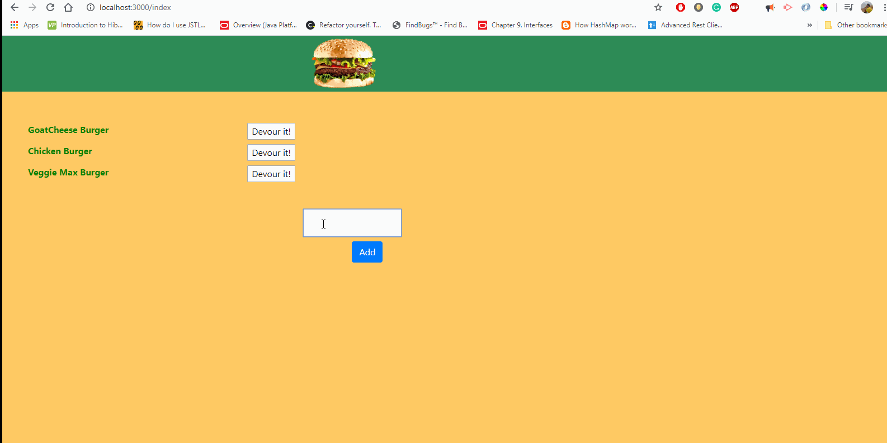

# burgers

A burger devouring Web-app made using node js, MySQL in MVC pattern.

## Table of Contents

- [Description](#Description)
- [Installation](#Installation)
- [Usage](#Usage)
- [Credits](#Credits)
- [License](#License)
- [Contributing](#Contributing)
- [Tests](#Tests)
- [Questions](#Questions)

## Description

A webpage that lets you add burgers to list of available burgers waiting to be devoured. You can devour a burger by clicking on the devour it! button. A burgers once devoured moves to list on the right.
The app is modeled in MVC pattern. Data is stored on MySQL DB so the data persists on page reload.  An instance on this Web-app is deployed at - 
https://immense-shore-38130.herokuapp.com/index

## Installation
To set-up the Web-app on your local machine, follow these steps - 

- Set Up MySQL server
- Run Schema.sql file on MySQL Workbench to create the DB. This should create burgers database.
- Optionally, run seed.sql
- run <code>npm install</code>
- run <code>node ./server.js</code>

## Usage

- Run <code>node./server.js</code> or <code>npm start</code> .

## Credits

sandyboon(https://github.com/sandyboon)

## License

Licensed under the MIT license.

## Contributing

Contribution to this project is not permitted at this moment.

## Tests

There are no tests at this moment.

## Questions

### Email : sandy.boon@gmail.com
